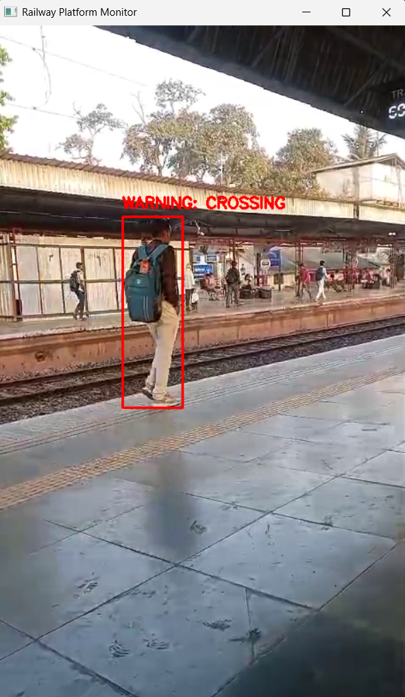
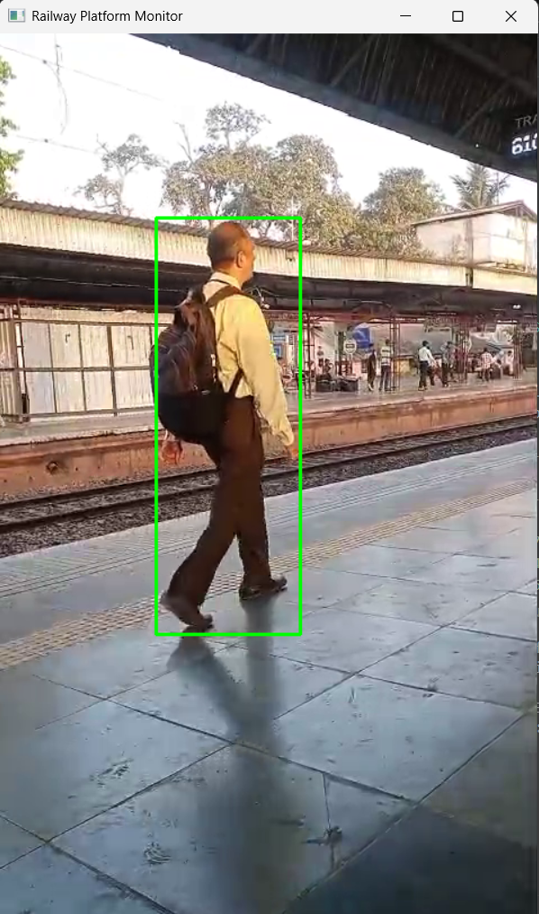

# 🚨 Railway Platform Safety Monitoring System

## 📌 Overview

This project is a real-time computer vision system designed to improve safety on railway platforms. It detects when a person enters a predefined danger zone near the platform edge and triggers an alert to prevent accidents.

The system uses object detection and spatial analysis to monitor unsafe behavior automatically.

---

> ⚡ Real-time safety monitoring using YOLOv8 and spatial analysis

## 🎥 Demo


---

## 🎯 Problem Statement

Crossing the yellow line on railway platforms is a major cause of accidents. Manual monitoring is unreliable and cannot scale effectively.

---

## 💡 Solution

This system:

* Detects people and trains in real-time
* Defines a virtual danger zone near the platform edge
* Estimates the person’s ground contact point (feet position)
* Triggers an alert if a person enters the danger zone (when no train is present)

---

### 💡 Key Idea

Instead of detecting the physical yellow line (which is unreliable due to lighting and occlusion), a predefined polygon is used to represent the unsafe region.

---

## ⚙️ Tech Stack

* Python
* OpenCV
* YOLOv8 (Ultralytics)
* NumPy
* Pygame

---

## 🔍 Features

- Real-time object detection
- Context-aware alert system (ignores train presence)
- Noise filtering for better accuracy
- Lightweight and runs on CPU

---

## 🧠 How It Works

### 1. Video Input

* Reads video frame-by-frame using OpenCV

### 2. Object Detection

* YOLOv8 detects objects like:

  * Person
  * Train

### 3. Train Check

* If a train is detected → alerts are disabled

### 4. Danger Zone

* A polygon is manually defined to represent the unsafe region near the platform edge

### 5. Person Detection & Filtering

* Small detections are ignored to remove noise

### 6. Feet Position Calculation

* Bottom-center of bounding box is used as the feet point

### 7. Violation Detection

* If feet point lies inside the danger zone → violation

### 8. Alert System

* Audio alert is triggered using Pygame
* Alert is played only once per entry to avoid repetition

---

## 🚀 How to Run

1. Clone the repository

```
git clone https://github.com/SakshiInData/RailwaySafety
cd RailwaySafety
```

2. Install dependencies

```
pip install ultralytics opencv-python numpy pygame
```

3. Run the script

```
python main.py
```

---

## 📂 Project Structure

```
RailwaySafety/
│── assets/
│   ├── platform.mp4
│   ├── warning.mpeg
│── main.py
│── README.md
```

---

## ⚠️ Limitations

* Manual danger zone definition (not adaptive)
* Accuracy depends on camera angle
* No object tracking (same person detected multiple times)
* YOLO may miss detections in crowded scenes

---

## 🔧 Future Improvements

* Add object tracking (DeepSORT)
* Automatic line detection
* Distance estimation
* Multi-camera integration
* Custom-trained model for railway environments

---

## 📊 Learning Outcomes

* Real-time object detection using YOLOv8
* Image processing with OpenCV
* Spatial analysis using polygons
* Designing safety-critical systems

---

## 📸 Output

- Green bounding box → Safe  
- Red bounding box → Danger  
- Warning message displayed  
- Audio alert triggered  




---

## 🤝 Contributing

Contributions are welcome. Feel free to fork the repo and improve the system.

---

## 📬 Contact

For any queries or suggestions, connect with me on LinkedIn.
[LinkedIn](https://linkedin.com/in/sakshi-patil-a42716289)
